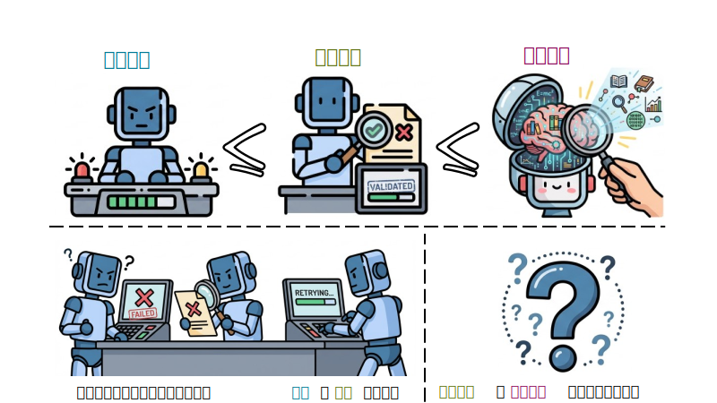
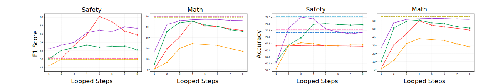
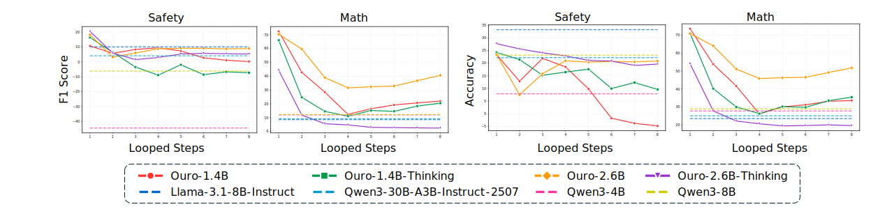
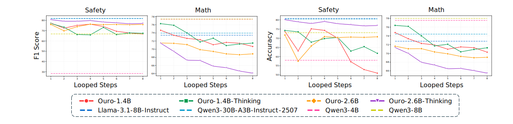
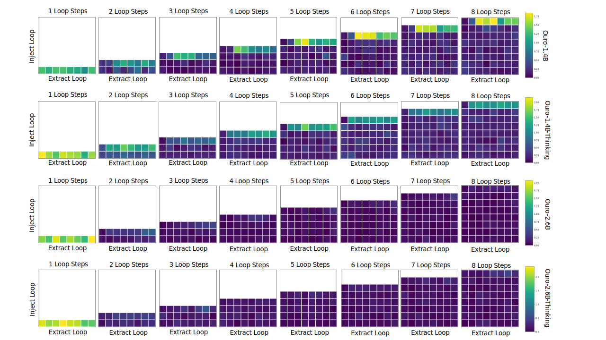

# Loop as a Bridge: Can Looped Transformers Close the Gap Between Outputs and Representations?

#### Introduction: When Expression Lags Behind Thought, Cognition Lags Behind Perception

Have you noticed that large language models often exhibit a kind of “expression lag”?

More concretely, if we decompose a model’s capabilities, we usually see three intriguing layers:

For a policy model $\pi$, a task ($T$), and a verifier ($V$) that checks whether the task is solved:

1. **Task Performance (TP, $P_{TP}(\pi) \triangleq \Pr_{A\sim\pi(\cdot| T)}[V(T,A)=1]$)**: Ask the model to solve a problem—it might get it wrong.
2. **Self-Verification (SV, $P_{SV}(\pi,A,s) \triangleq \Pr[SV_s(T,A)=V(T,A)]$, where $s$ is some verification strategy)**: Even when it answers incorrectly, if you ask it to check its own work, it can often say “this isn’t right.” This suggests its **language-based verification ability (SV)** can be stronger than its **execution ability (A)**.
3. **Representation Readout (RR, $P_{RR}(\pi,A,l,g) \triangleq \Pr[ RR_l(T,A)=V(T,A) ]$, where $RR_l(T,A) \triangleq g(h_l(T,A))$ is a monitor $g$ trained on layer-$l$ representations)**: If we bypass language output and probe internal activations directly, we may find the model “internally” encodes features strongly correlated with correctness.

A growing body of work supports an inequality like:

$$
\sup_{\pi} P_{TP}(\pi) \le \sup_{\pi,A,s} P_{SV}(\pi,A,s) \le \sup_{\pi,A,l,g} P_{RR}(\pi,A,l,g)
$$

|            |
| :------------------------------: |
| A gap often exists among the three layers in practice |

In other words, the model can be a paradox: **“it knows” internally (RR), but “can’t quite say it” in language (SV), which leads to “can’t reliably do it” (TP).** Chain-of-thought and related techniques sketch a path for $P_{TP}$ to catch up to $P_{SV}$. **But who closes the gap between $P_{SV}$ and $P_{RR}$?** Why can’t deep intuition be perfectly translated into explicit language?

This is exactly what we aim to explore.

To narrow the gap between “intuition” and “expression,” we turn to **Looped Transformers**.

#### The Challenger: The “Introspective” Potential of Looped Transformers

Unlike the standard Transformer’s one-pass feedforward depth, a Looped Transformer allows hidden states to circulate and be iteratively refined. You can think of it as the model **“ruminating”** a few times before it speaks.

> [!TIP]
>
> **What is a Looped Transformer?**
>
> If CoT trades **sequence length** for thinking time, and scaling laws trade **parameters and data** for capability, Looped Transformers open another scaling axis: **depth via recurrence**.
>
> The key idea is **weight sharing + recursive processing**. Instead of eagerly decoding intermediate features into discrete tokens, the model feeds its internal hidden state back through the *same* set of weights for multiple loops.
>
> An analogy: before speaking (decoding), humans often “think again” using limited brain capacity (parameters), but investing additional computation to improve the quality of reasoning.
>
> Current explorations broadly focus on two questions: **how to loop** and **when/how many times to loop**.
>
> **How to loop**
>
> - **PonderLM** [1,2] turns discrete next-token prediction into a continuous-space update by taking probability-weighted sums of token embeddings, iteratively refining predictions.
> - **Retrofitting-Recurrence** [3] modifies existing models by making only a subset of middle layers recurrent, while keeping shallow/deep layers for encoding/decoding.
> - **THINK-AT-HARD** [4] introduces LoRA adapters and duo-causal attention during latent iteration, explicitly teaching the model how to use extra compute.
>
> **Where/when to loop?**
>
> > Not every token deserves deep thought. Stopwords like “the” or “is” don’t need it, while key logical pivots might.
>
> - **Google’s MoR** [5] learns a routing mechanism that allocates a compute budget (number of loops) dynamically per token.
> - **THINK-AT-HARD** uses an Oracle Iteration Policy: if a SFT variant of the base model predicts incorrectly, that token is retroactively labeled as needing loops.
> - **SEED’s OURO** [7] introduces **early stopping**. During pretraining, it trains all loops up to a max depth and uses entropy regularization plus adaptive gating to let the model decide when to stop.
>
> In our experiments, we choose **OURO** as the main subject—not only for its strong scaling and performance, but also for its good support in the **vLLM** inference stack, which makes our verification experiments significantly more practical.

Our hope: looping is not merely “more FLOPs,” but an **internalized probe**. Extra nonlinear processing over the representation stream might endow the model with a kind of **introspection**—better translating deep, implicit representations (RR) into explicit language judgments (SV).

With that vision, we ran experiments with a Looped Transformer setup. The results are both exciting and puzzling.

#### Finding 1: The Gap Really Shrinks—but at What Cost?

In both math and safety scenarios, we compared performance between a **Language Monitor** and a **Representation Monitor**.

Our expectation: with more loops, as the model “thinks longer,” its language-based verification (SV) should move closer to what its internal representations (RR) already encode.

**The results confirm this—partially:** as the number of loops increases, the gap (representation-probe performance minus language-judgment performance) indeed decreases slowly.

- **Good news:** language-based verification accuracy improves with more loops. The model seems more capable of articulating and checking correctness after “ruminating.”

|      |
| :-------------------------------------------------------------------------: |
|                    Language-based verification vs. loops                     |
|              |
|                          Gap decreases with more loops                        |

- **Bad news (or a fascinating tradeoff):** part of the gap reduction comes from **representation monitoring getting worse**.

|  |
| :-------------------------------------------------------------------------: |
|                 Representation monitoring decreases with more loops          |

This hints at a harsh possibility: **looping may organize expression while also compressing/eroding the “raw” internal signal.** If “thinking too long” dulls the sharpness of “intuition,” is it worth it? This is something we must take seriously.

#### Finding 2: Schrödinger’s “Introspection”—Does It Really Know What It’s Thinking?

To test whether the model truly gains introspective ability, we follow Anthropic-style setup [8] and run a **“thought injection”** experiment.

During the model’s latent thinking, we forcibly inject a specific concept vector (Concept Vector), and then check whether the model can notice: “something strange just entered my mind.”

The result is counterintuitive:

|  |
| :--------------------------------------------------------------------------------------------------: |
|                 The model recognizes injected representations mainly near output time                 |

- In early loops, regardless of what vector we inject, the model effectively ignores it—almost like it’s “unconscious.”
- **Only in the final loop** does the injected representation become identifiable by the model.

This is the opposite of what we hoped for (“continuous introspection”). It suggests that even with a recurrent architecture, semantic access to internal states may remain local and short-sighted: the model doesn’t continuously monitor itself, and only “wakes up” right before it has to commit to an output.

#### Closing Thoughts

Our experiments focus on one particular implementation of Looped Transformers. The limitations we observed—representation degradation or lack of sustained monitoring—should not be interpreted as universal flaws of the entire approach. On the contrary, we still view Looped Transformers as a promising direction for aligning language behavior with internal representations.

At the same time, our results highlight a more subtle truth: **looping can make models “say” things better, but not necessarily “think” more clearly.** This non-synchronous evolution of expression and representation may be a key obstacle on the road toward better alignment and more advanced intelligence. We hope these empirical observations provide useful guidance for future research; with improved objectives and architectural refinements, these obstacles may be overcome.

For a fuller discussion of our modeling choices, experimental details, and complete results, see the [Report]([http://www.github.com](https://github.com/biuboomc/L-A-B/blob/main/Loop_blog_report_0114.pdf)).

@article{,
  title={},
  author={},
  journal={URL https://github.com/biuboomc/L-A-B/blob/main/Loop_blog_report_0114.pdf}
}

[1] Zeng B, Song S, Huang S, et al. Pretraining Language Models to Ponder in Continuous Space[J]. arXiv preprint arXiv:2505.20674, 2025.

[2] Zeng B, Li H, Song S, et al. PonderLM-2: Pretraining LLM with Latent Thoughts in Continuous Space[J]. arXiv preprint arXiv:2509.23184, 2025.

[3] McLeish S, Li A, Kirchenbauer J, et al. Teaching Pretrained Language Models to Think Deeper with Retrofitted Recurrence[J]. arXiv preprint arXiv:2511.07384, 2025.

[4] Fu T, You Y, Chen Z, et al. Think-at-Hard: Selective Latent Iterations to Improve Reasoning Language Models[J]. arXiv preprint arXiv:2511.08577, 2025.

[5] Bae S, Kim Y, Bayat R, et al. Mixture-of-recursions: Learning dynamic recursive depths for adaptive token-level computation[J]. arXiv preprint arXiv:2507.10524, 2025.

[7] Zhu R J, Wang Z, Hua K, et al. Scaling latent reasoning via looped language models[J]. arXiv preprint arXiv:2510.25741, 2025.

[8] Lindsey J. Emergent introspective awareness in large language models[J]. arXiv preprint arXiv:2601.01828, 2026.
